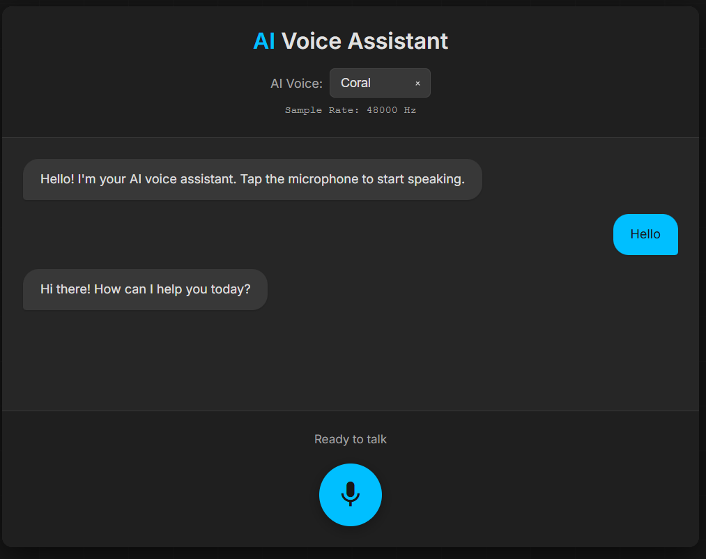

# 🎙️AI Voice Assistant

A real-time voice conversation AI assistant powered by OpenAI's GPT models, Whisper speech recognition, and text-to-speech synthesis. Features streaming responses for ultra-low latency interactions.

# ✨ Features

🎤 Real-time Voice Recognition - Speak naturally, powered by OpenAI Whisper

🤖 Intelligent Conversations - GPT-4o-mini for fast, contextual responses

🔊 Natural Text-to-Speech - Multiple voice options with OpenAI TTS

⚡ Streaming Mode - See transcription and responses as they happen (0.5-1.5s perceived latency)

🌤️ Weather Tool - Ask about weather in any location

🎨 Modern UI - Clean, responsive dark-mode interface

📊 Real-time Stats - Audio quality and processing metrics
